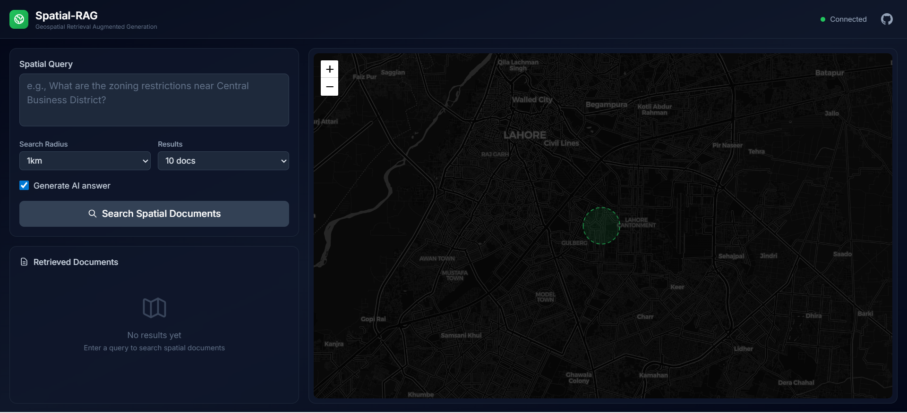
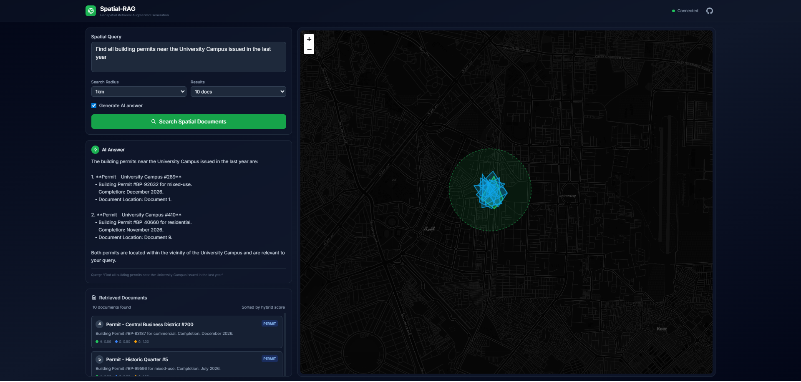
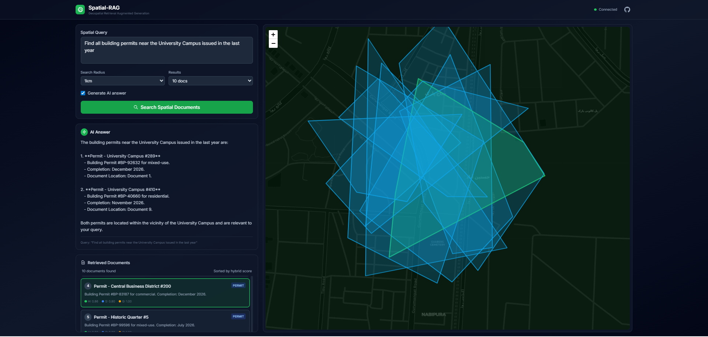
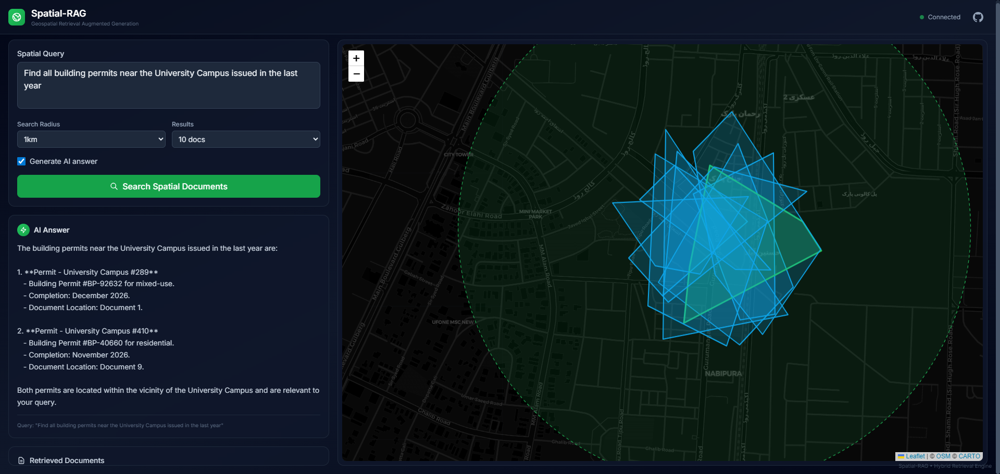

# Spatial-RAG

**Spatial Retrieval Augmented Generation for Real-World Geospatial Reasoning**

[](https://opensource.org/licenses/MIT)
[](https://www.python.org/downloads/)
[](https://nextjs.org/)

A production-ready full-stack system that combines semantic search with spatial proximity to retrieve and reason over geospatial documents. Built for exploring latent world models and spatial intelligence for embodied systems.

## 🎯 Overview

Spatial-RAG extends classic RAG by adding a spatial retrieval layer that enforces geographic constraints before or during semantic retrieval, then merges the results with an LLM-guided generator. This enables queries like:

- *"What are the zoning restrictions within 500 meters of Elm Park?"*
- *"Find all building permits near the University Campus issued in the last year"*
- *"What environmental regulations apply to the Riverside Development area?"*

## ✨ Features

- **🌍 Hybrid Spatial-Semantic Retrieval**: Combines BGE embeddings (semantic similarity) with PostGIS spatial queries (geographic proximity)
- **🔒 Local Embeddings**: Uses `BAAI/bge-small-en-v1.5` (384 dimensions) for zero API cost during development
- **🗺️ Interactive Map UI**: Leaflet-based visualization with marker clustering, polygon drawing, and real-time search radius visualization
- **⚡ Streaming Responses**: Server-Sent Events (SSE) for real-time LLM answer generation
- **📊 Hybrid Scoring**: Tunable multi-objective ranking combining semantic relevance and spatial proximity
- **🧪 Synthetic Data Generator**: Built-in tool for generating realistic test datasets with 1000+ spatial documents
- **🐳 Docker-First**: Complete containerized setup with PostGIS + pgvector + FastAPI + Next.js

## 📸 Screenshots

<div align="center">

### Main Interface

*Spatial-RAG main interface showing query panel, interactive map, and results visualization*

### Query Results with Map

*Example query results with retrieved documents displayed on map and in list, with AI-generated answer*

### Interactive Map Detail

*Close-up view of the interactive map showing search radius, document markers, and spatial clustering*

### AI Answer Generation

*AI-generated answer based on spatially-relevant retrieved documents*

</div>

> **📷 Screenshot Instructions**: To add screenshots, follow the guide in [docs/TAKE_SCREENSHOTS.md](docs/TAKE_SCREENSHOTS.md). The application must be running at http://localhost:3000 to capture screenshots.

## 🏗️ Architecture

```
┌─────────────────┐     ┌──────────────────┐     ┌─────────────────┐
│  Next.js +      │────▶│  FastAPI         │────▶│  PostGIS +      │
│  Leaflet UI     │◀────│  + BGE Embeddings│◀────│  pgvector       │
└─────────────────┘     └──────────────────┘     └─────────────────┘
     Port 3000              Port 8080              Port 5432
```

### Component Details

- **Frontend (Next.js 14)**: React 18, TypeScript, Tailwind CSS, Zustand state management
- **Backend (FastAPI)**: Python 3.11, async endpoints, CORS enabled, SSE streaming
- **Database**: PostgreSQL 15 with PostGIS 3.4 and pgvector extensions
- **Embeddings**: Sentence-transformers with BGE-small-en-v1.5 (384 dims, ~33M params)
- **Spatial Indexing**: H3 hierarchical spatial indexing for efficient geographic queries

## 🚀 Quick Start

### Prerequisites

- **Docker** 20.10+ and **Docker Compose** 2.0+
- **Python** 3.11+ (for local development/scripting)
- **Node.js** 20+ (for frontend development, optional)

### Installation

1. **Clone the repository**

```bash
git clone https://github.com/yourusername/Spatial-RAG.git
cd Spatial-RAG
```

2. **Set up environment variables**

```bash
cp .env.example .env
# Edit .env and add your OPENAI_API_KEY (optional, for LLM synthesis)
```

3. **Start all services**

```bash
docker-compose up -d
```

This will start:
- PostgreSQL with PostGIS + pgvector on port 5432
- FastAPI backend on port 8080
- Next.js frontend on port 3000

4. **Wait for services to be ready**

```bash
# Check database is ready
docker-compose logs db | grep "database system is ready"

# Check API is running
curl http://localhost:8080/health
```

5. **Seed the database with synthetic data**

```bash
# Option 1: Using the seed script in the API container
docker exec -it spatial_rag_api python /app/seed.py 500

# Option 2: Using the scripts directory (if running locally)
cd scripts
pip install -r ../api/requirements.txt
python seed_db.py --num-docs 500 --clear
```

6. **Access the application**

- **Frontend**: http://localhost:3000
- **API**: http://localhost:8080
- **API Documentation**: http://localhost:8080/docs
- **Health Check**: http://localhost:8080/health

## 📁 Project Structure

```
Spatial-RAG/
├── api/                          # FastAPI backend
│   ├── app/
│   │   ├── __init__.py
│   │   ├── main.py              # FastAPI app entry, endpoints
│   │   ├── config.py            # Settings and configuration
│   │   ├── database.py          # PostgreSQL connection utilities
│   │   ├── embeddings.py        # BGE local embedding model
│   │   ├── retriever.py         # SpatialHybridRetriever class
│   │   ├── spatial_query.py     # PostGIS query builders
│   │   └── llm_generator.py     # OpenAI LLM integration
│   ├── Dockerfile               # Backend container definition
│   ├── requirements.txt         # Python dependencies
│   └── seed.py                  # Quick database seeding script
├── frontend/                     # Next.js 14 application
│   ├── app/
│   │   ├── layout.tsx           # Root layout
│   │   ├── page.tsx             # Main query interface
│   │   ├── globals.css          # Global styles
│   │   ├── components/
│   │   │   ├── Map.tsx          # Leaflet map component
│   │   │   ├── QueryPanel.tsx   # Query input form
│   │   │   ├── ResultsList.tsx  # Document results display
│   │   │   └── AnswerDisplay.tsx # AI answer display
│   │   ├── lib/
│   │   │   ├── schemas.ts       # Zod validation schemas
│   │   │   └── geojson.ts      # GeoJSON utilities
│   │   └── store/
│   │       └── useStore.ts     # Zustand state management
│   ├── Dockerfile               # Frontend container definition
│   ├── package.json            # Node.js dependencies
│   ├── next.config.js           # Next.js configuration
│   ├── tailwind.config.ts       # Tailwind CSS configuration
│   └── tsconfig.json            # TypeScript configuration
├── db/
│   └── Dockerfile               # Custom PostGIS + pgvector image
├── scripts/
│   ├── synthetic_data.py        # Synthetic document generator
│   └── seed_db.py              # Database seeding script
├── schema.sql                   # PostGIS + pgvector database schema
├── docker-compose.yml           # Service orchestration
├── nginx.conf                   # Nginx reverse proxy config (optional)
├── .env.example                 # Environment variables template
├── .gitignore                   # Git ignore rules
├── LICENSE                      # MIT License
└── README.md                    # This file
```

## 🔌 API Documentation

### Endpoints

#### `POST /query`

Main Spatial-RAG query endpoint. Performs hybrid spatial + semantic retrieval and optionally generates an LLM-synthesized answer.

**Request Body:**

```json
{
  "query": "What are the zoning restrictions near Central Park?",
  "center_lat": 31.5204,
  "center_lon": 74.3587,
  "radius_m": 1000,
  "top_k": 10,
  "include_answer": true,
  "region_geojson": null
}
```

**Response:**

```json
{
  "query": "What are the zoning restrictions near Central Park?",
  "answer": "Based on the retrieved documents...",
  "documents": [
    {
      "id": "uuid",
      "title": "Zoning Report - Central Park #1",
      "content": "Zoning classification: R-2...",
      "geometry": {
        "type": "Point",
        "coordinates": [74.3587, 31.5204]
      },
      "metadata": {
        "doc_type": "zoning",
        "authority_score": 0.85
      },
      "scores": {
        "semantic": 0.82,
        "spatial": 0.95,
        "hybrid": 0.87
      },
      "spatial_distance_m": 245.3
    }
  ],
  "total_count": 10
}
```

#### `GET /stream?q={query}&center_lat={lat}&center_lon={lon}&radius_m={radius}`

Server-Sent Events endpoint for streaming LLM responses in real-time.

**Example:**

```bash
curl "http://localhost:8080/stream?q=zoning%20regulations&center_lat=31.5204&center_lon=74.3587&radius_m=1000"
```

**Event Types:**
- `metadata`: Initial document count and metadata
- `chunk`: Streaming text chunks
- `done`: Completion event
- `error`: Error event

#### `GET /documents?limit=100&offset=0`

List all documents in the database with pagination.

#### `GET /documents/{doc_id}`

Get a specific document by ID.

#### `GET /health`

Health check endpoint returning service status and configuration.

## ⚙️ Configuration

### Environment Variables

Create a `.env` file from `.env.example`:

```bash
cp .env.example .env
```

**Required Variables:**

| Variable | Default | Description |
|----------|---------|-------------|
| `DATABASE_HOST` | `db` | PostgreSQL host (use `db` for Docker, `localhost` for local) |
| `DATABASE_PORT` | `5432` | PostgreSQL port |
| `DATABASE_NAME` | `spatial_rag` | Database name |
| `DATABASE_USER` | `postgres` | Database user |
| `DATABASE_PASSWORD` | `postgres` | Database password |

**Optional Variables:**

| Variable | Default | Description |
|----------|---------|-------------|
| `OPENAI_API_KEY` | - | OpenAI API key for LLM synthesis (leave empty for mock responses) |
| `EMBEDDING_MODEL` | `BAAI/bge-small-en-v1.5` | Sentence transformer model |
| `EMBEDDING_DIMENSION` | `384` | Embedding vector dimension |
| `RETRIEVAL_TOP_K` | `10` | Default number of results |
| `HYBRID_ALPHA` | `0.7` | Semantic score weight (0-1) |
| `HYBRID_BETA` | `0.3` | Spatial score weight (0-1) |
| `DEFAULT_RADIUS_M` | `1000` | Default search radius in meters |
| `LLM_MODEL` | `gpt-4o-mini` | OpenAI model for synthesis |
| `LLM_TEMPERATURE` | `0.0` | LLM temperature (0-2) |

### Hybrid Scoring Formula

Documents are ranked using a weighted combination:

```
hybrid_score = α × semantic_similarity + β × spatial_score
```

Where:
- `semantic_similarity = 1 - cosine_distance(query_embedding, doc_embedding)`
- `spatial_score = 1 / (1 + distance_meters)`
- `α` (alpha) = semantic weight (default: 0.7)
- `β` (beta) = spatial weight (default: 0.3)

Tune these weights based on your use case:
- **Higher α**: Prioritize semantic relevance (good for conceptual queries)
- **Higher β**: Prioritize spatial proximity (good for location-specific queries)

## 💻 Development

### Backend Development

```bash
cd api

# Install dependencies
pip install -r requirements.txt

# Run with hot reload
uvicorn app.main:app --reload --port 8080

# Run tests (if available)
pytest
```

### Frontend Development

```bash
cd frontend

# Install dependencies
npm install

# Run development server
npm run dev

# Build for production
npm run build

# Start production server
npm start
```

### Database Management

```bash
# Connect to PostGIS database
docker exec -it spatial_rag_db psql -U postgres -d spatial_rag

# Verify extensions are installed
\dx

# Check document count
SELECT COUNT(*) FROM spatial_docs;

# View sample documents
SELECT id, title, ST_AsText(geom) as location, metadata->>'doc_type' as type
FROM spatial_docs
LIMIT 10;

# Test spatial query
SELECT title, ST_Distance(geom::geography, ST_SetSRID(ST_Point(74.3587, 31.5204), 4326)::geography) as distance_m
FROM spatial_docs
WHERE ST_DWithin(geom::geography, ST_SetSRID(ST_Point(74.3587, 31.5204), 4326)::geography, 1000)
ORDER BY distance_m
LIMIT 5;
```

### Generating Synthetic Data

```bash
# Using the seed script
docker exec -it spatial_rag_api python /app/seed.py 1000

# Or using the scripts directory
cd scripts
python seed_db.py --num-docs 1000 --clear --lat 31.5204 --lon 74.3587 --city "Lahore"
```

**Options:**
- `-n, --num-docs`: Number of documents to generate (default: 1000)
- `--clear`: Clear existing documents before seeding
- `--lat`: Center latitude (default: 31.5204)
- `--lon`: Center longitude (default: 74.3587)
- `--city`: City name for metadata (default: "Lahore")
- `--verify-only`: Only verify existing data, don't seed

## 🧪 Usage Examples

### Example 1: Basic Spatial Query

```bash
curl -X POST http://localhost:8080/query \
  -H "Content-Type: application/json" \
  -d '{
    "query": "What are the zoning regulations near University Campus?",
    "center_lat": 31.5204,
    "center_lon": 74.3587,
    "radius_m": 1000,
    "top_k": 5,
    "include_answer": true
  }'
```

### Example 2: Query with Custom Region (GeoJSON)

```bash
curl -X POST http://localhost:8080/query \
  -H "Content-Type: application/json" \
  -d '{
    "query": "Find all building permits in this area",
    "region_geojson": {
      "type": "Polygon",
      "coordinates": [[
        [74.35, 31.51],
        [74.36, 31.51],
        [74.36, 31.52],
        [74.35, 31.52],
        [74.35, 31.51]
      ]]
    },
    "top_k": 20
  }'
```

### Example 3: Streaming Response

```bash
curl -N "http://localhost:8080/stream?q=zoning%20regulations&center_lat=31.5204&center_lon=74.3587&radius_m=2000"
```

### Example 4: Frontend Integration

```typescript
const response = await fetch('http://localhost:8080/query', {
  method: 'POST',
  headers: { 'Content-Type': 'application/json' },
  body: JSON.stringify({
    query: 'What are the zoning restrictions near Central Park?',
    center_lat: 31.5204,
    center_lon: 74.3587,
    radius_m: 1000,
    top_k: 10,
    include_answer: true
  })
});

const data = await response.json();
console.log('Answer:', data.answer);
console.log('Documents:', data.documents);
```

## 🔧 Troubleshooting

### Database Connection Issues

```bash
# Check if database is running
docker-compose ps db

# Check database logs
docker-compose logs db

# Verify PostGIS extension
docker exec -it spatial_rag_db psql -U postgres -d spatial_rag -c "SELECT PostGIS_version();"
```

### API Not Responding

```bash
# Check API logs
docker-compose logs api

# Restart API service
docker-compose restart api

# Check if port 8080 is available
netstat -an | grep 8080
```

### Frontend Build Issues

```bash
# Clear Next.js cache
cd frontend
rm -rf .next node_modules
npm install
npm run dev
```

### Embedding Model Download Issues

The BGE model (~133MB) is downloaded automatically on first use. If download fails:

```bash
# Pre-download the model
docker exec -it spatial_rag_api python -c "from sentence_transformers import SentenceTransformer; SentenceTransformer('BAAI/bge-small-en-v1.5')"
```

### OpenAI API Errors

If you see `Client.__init__() got an unexpected keyword argument 'proxies'`:

```bash
# Upgrade OpenAI library
docker exec -it spatial_rag_api pip install --upgrade "openai>=1.40.0"
docker-compose restart api
```

## 🧩 Key Technologies

- **Backend**: FastAPI, PostgreSQL 15, PostGIS 3.4, pgvector
- **Embeddings**: sentence-transformers, BGE-small-en-v1.5 (384 dims)
- **Frontend**: Next.js 14, React 18, TypeScript, Taillet, Zustand, Tailwind CSS
- **Spatial**: H3 hierarchical indexing, GeoJSON, WKT, Shapely
- **LLM**: OpenAI API (optional, with mock fallback)
- **Containerization**: Docker, Docker Compose

## 📚 References

- [Spatial-RAG Paper (arXiv:2502.18470)](https://arxiv.org/abs/2502.18470)
- [PostGIS Documentation](https://postgis.net/docs/)
- [pgvector GitHub](https://github.com/pgvector/pgvector)
- [BGE Embeddings (Hugging Face)](https://huggingface.co/BAAI/bge-small-en-v1.5)
- [FastAPI Documentation](https://fastapi.tiangolo.com/)
- [Next.js Documentation](https://nextjs.org/docs)
- [Leaflet Documentation](https://leafletjs.com/)

## 🤝 Contributing

Contributions are welcome! Please feel free to submit a Pull Request.

1. Fork the repository
2. Create your feature branch (`git checkout -b feature/AmazingFeature`)
3. Commit your changes (`git commit -m 'Add some AmazingFeature'`)
4. Push to the branch (`git push origin feature/AmazingFeature`)
5. Open a Pull Request

### Development Guidelines

- Follow PEP 8 for Python code
- Use TypeScript for frontend code
- Add docstrings to all functions and classes
- Update README.md for new features
- Test your changes locally before submitting

## 📝 License

This project is licensed under the MIT License - see the [LICENSE](LICENSE) file for details.

## 🙏 Acknowledgments

- Inspired by the Spatial-RAG research paper
- Built with amazing open-source tools: PostGIS, pgvector, FastAPI, Next.js, Leaflet
- BGE embeddings by BAAI (Beijing Academy of Artificial Intelligence)

## 📧 Contact

For questions, issues, or contributions, please open an issue on GitHub.

---

**Made with ❤️ for exploring spatial intelligence and latent world models**
